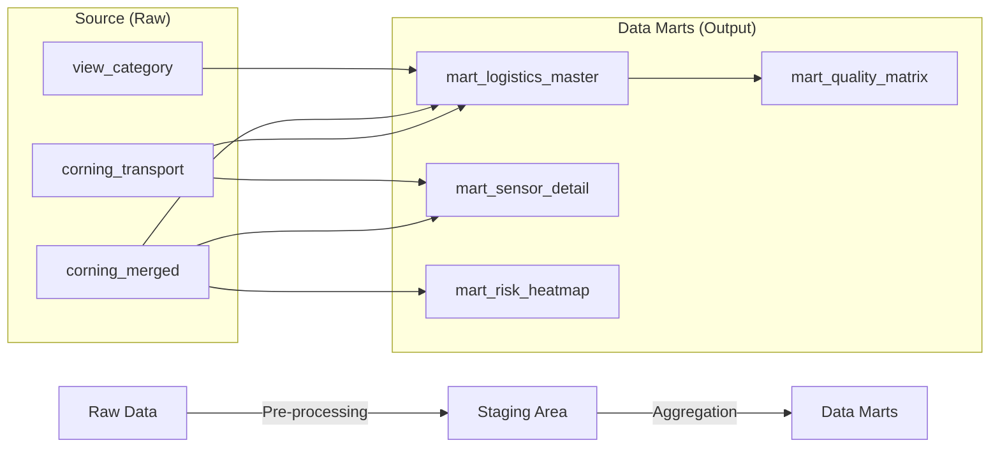

# 🛠️ 데이터 처리 및 마트 구축 명세서 (ETL Documentation)

이 문서는 `scripts/sync_data.py` 스크립트가 수행하는 데이터 전처리(ETL) 로직과 생성되는 빅쿼리 마트(Data Mart)의 상세 명세를 기술합니다.

---

## 1. 🔄 ETL 개요 (Overview)

Willog의 원천 데이터(`Raw Data`)를 RAG 시스템과 데이터 분석에 적합한 형태(`Data Mart`)로 가공하는 과정입니다.

*   **Source (Input)**:
    *   `corning_transport`: 운송 마스터 정보 (출발지, 도착지, 제품명 등)
    *   `corning_merged`: 센서 로거에서 수집된 시계열 데이터 (온도, 습도, 충격 등)
*   **Process**: SQL 기반의 집계 및 조인 (BigQuery ELT)
*   **Destination (Output)**: `mart_*` 접두사가 붙은 4개의 분석용 테이블

### 데이터 흐름도

---

## 2. 📊 테이블 정의 및 처리 로직

### 2.1 `mart_logistics_master` (운송 건 마스터)
운송 건(Shipment) 단위로 "얼마나 안전하게 배송되었는가?"를 요약한 테이블입니다.

*   **생성 주기**: 매일 (Partition: `departure_date`)
*   **주요 컬럼 및 로직**:
    *   **`cumulative_shock_index` (누적 충격 피로도)**
        *   **공식**: `SUM(POWER(shock_high, 1.5))` (단, `shock_high > 2G` 인 이벤트만)
        *   **의미**: 단순 충격 횟수보다 강한 충격에 가중치를 두어 물품에 쌓인 피로도를 수치화.
    *   **`temp_excursion_duration_min` (온도 이탈 지속 시간)**
        *   **공식**: `COUNTIF(temp < 0 OR temp > 25) * 10`
        *   **가정**: 로그 간격이 약 10분이라고 가정하여, 이탈 건수에 10을 곱해 분(minute) 단위로 환산.
    *   **`risk_level` (종합 리스크 등급)**
        *   `Critical`: 실제 파손 발생(`is_damaged = TRUE`)
        *   `High`: 누적 충격 500 이상 OR 온도 이탈 60분 이상
        *   `Medium`: 최대 충격(`max_shock_g`) 8G 초과
        *   `Low`: 그 외 정상 케이스

### 2.2 `mart_sensor_detail` (센서 상세 로그)
분석가가 특정 운송 건의 상황을 시계열로 깊이 있게 파고들 때 사용합니다.

*   **특징**:
    *   조인 성능 향상을 위해 `transport_mode`, `destination_country` 등 자주 쓰이는 마스터 정보를 미리 조인(Denormalization)해 두었습니다.
    *   **국가 코드 추출**: `destination` 값(예: `USLAX`, `CNPVG`)의 앞 2자리를 파싱하여 `destination_country`(`USA`, `China` 등) 생성.
    *   **상태 판별 (`status`)**: 가속도(`acc`)가 0.2 미만이면 `Static`(정지), 이상이면 `Moving`(이동)으로 분류.

### 2.3 `mart_risk_heatmap` (리스크 히트맵)
지도 시각화를 위해 지리적 좌표(`lat`, `lon`) 기준으로 위험도를 사전 집계한 테이블입니다.

*   **집계 기준**: 위/경도를 소수점 2자리로 반올림(`ROUND(lat, 2)`)하여 약 1km 반경으로 격자화(Grid)함.
*   **`risk_score` (위험도 점수)**
    *   **공식**: `(High Impact Count / Total Logs) * Avg Shock Intensity`
    *   **의미**: 해당 지역에서 강한 충격이 얼마나 자주, 얼마나 세게 발생하는지를 복합적으로 평가.

### 2.4 `mart_quality_matrix` (품질 매트릭스)
운송사나 경로의 품질을 비교 평가(Benchmarking)하기 위한 고수준 집계 테이블입니다.

*   **활용**: "항공 운송과 해상 운송의 파손율 비교", "베트남 경로의 안전 점수" 등 KPI 조회용.
*   **`safety_score` (안전 점수)**
    *   **공식**: `100 - (% of High/Critical Risk Shipments)`
    *   **의미**: 100점 만점 기준으로, 위험 등급 운송 건이 없을수록 100점에 가까움.

---

## 3. 📝 참고 사항 (Implementation Notes)

1.  **파티셔닝 (Partitioning)**
    *   대용량 데이터 조회를 최적화하기 위해, 날짜 컬럼(`departure_date`, `event_date`) 기준으로 파티셔닝이 적용되어 있습니다. 쿼리 시 `WHERE date = ...` 조건을 사용하면 비용을 크게 절감할 수 있습니다.
2.  **클러스터링 (Clustering)**
    *   자주 조회되는 필터 조건(`destination`, `product`, `risk_level`)으로 클러스터링을 설정하여 검색 성능을 높였습니다.
3.  **데이터 정합성**
    *   이 스크립트는 `CREATE OR REPLACE TABLE` 구문을 사용하므로, 실행 시마다 마트 테이블이 완전히 재생성됩니다. (Full Refresh 방식)
