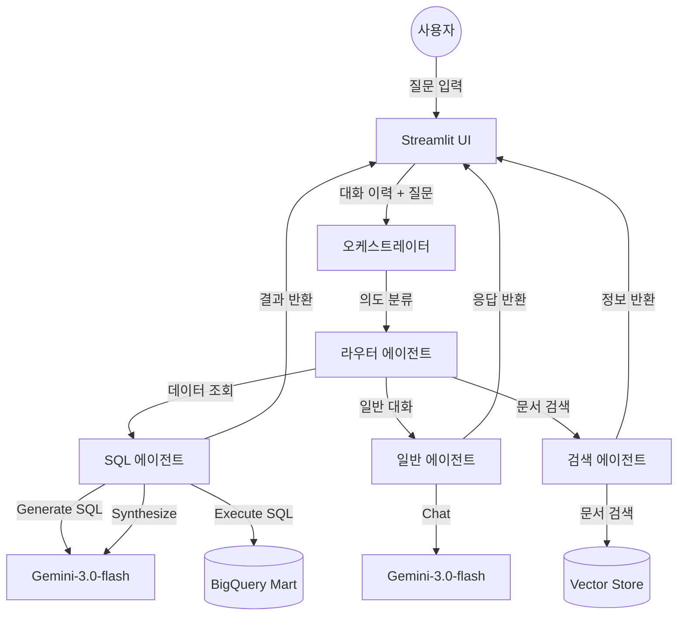

# 📘 Willog Intelligent Assistant - 시스템 기술 명세서

## 1. 🛠️ 개발 스펙 (Development Specs)

### 1.1 기술 스택 (Tech Stack)
- **언어**: Python 3.9+
- **프레임워크**:
    - **LLM 오케스트레이션**: LangChain (Core, Google VertexAI)
    - **웹 인터페이스**: Streamlit
    - **데이터 시각화**: Plotly, Streamlit Native Charts
- **인프라**:
    - **클라우드**: Google Cloud Platform (GCP)
    - **컴퓨팅**: Cloud Run (Serverless Container)
    - **LLM 모델**: Vertex AI (`gemini-3.0-flash`)
    - **데이터 웨어하우스**: BigQuery
- **배포**:
    - **CI/CD**: GitHub -> Google Cloud Build -> Cloud Run

### 1.2 환경 변수 및 설정
- `PROJECT_ID`: `willog-prod-data-gold`
- `LOCATION`: `asia-northeast3` (Seoul) / `us-central1` (Vertex AI)
- `GOOGLE_APPLICATION_CREDENTIALS`: GCP 서비스 계정 키

---

## 2. 🏗️ 시스템 아키텍처 (Architecture)

### 2.1 아키텍처 다이어그램

### 2.2 데이터 처리 흐름
1.  **입력 (Input)**: 사용자가 UI에 자연어 질문 입력 (예: "베트남 운송 물량은?").
2.  **라우팅 (Routing)**: `Router`가 질문의 의도를 파악하여 적절한 에이전트 선택.
3.  **실행 (Execution)**:
    *   `SQL Agent`: 스키마 기반 SQL 생성 -> BigQuery 실행 -> 결과 요약.
    *   `General Agent`: LLM 기반 일반 대화 수행 및 물류 용어 설명 (이전 대화 맥락 반영).
4.  **출력 (Output)**: 텍스트 답변 및 자동 생성된 데이터 시각화(차트) 제공.

---

## 3. 🧠 LLM 구조 및 에이전트 (LLM Structure)

### 3.1 Router Agent (`gemini-3.0-flash`)
- **역할**: 사용자 질문의 의도를 분류하여 적절한 전문가 에이전트에게 전달.
- **분류 로직**:
    - 통계/수치/데이터 질문 -> `SQL_AGENT`
    - 인사말/기능문의/일반대화 -> `GENERAL_AGENT`
    - 문서/규정/가이드 -> `RETRIEVAL_AGENT`
- **안전장치 (Fallback)**: LLM이 판단하지 못하거나 오류 발생 시, 키워드 매칭을 통해 강제로 라우팅.

### 3.2 SQL Agent (데이터 분석가)
- **역할**: 정량적 데이터 분석 및 SQL 쿼리 생성.
- **프롬프트 전략**:
    - **스키마 주입 (Schema Injection)**: BigQuery 테이블 정보(`mart_logistics_master` 등)를 프롬프트에 동적으로 포함.
    - **퓨샷 러닝 (Few-shot Learning)**: 자주 사용하는 쿼리(비율, 날짜 필터링 등) 예제 제공.
    - **맥락 인식 (Context Awareness)**: 이전 대화(`chat_history`)를 참고하여 "그 중에서 파손된 건?" 같은 지시어 해석.
- **데이터 정규화**: `transport_mode` 값을 소문자(`ocean`, `air`)로 변환하여 쿼리 정확도 향상.

### 3.3 General Agent (가상 비서)
- **역할**: 사용자 경험(UX) 향상 및 일반 대화 처리.
- **기능**: 서비스 소개, 물류 용어 설명, 가벼운 인사.
- **특징**: 데이터베이스 접근 없이 LLM 자체 지식과 프롬프트를 활용하여 답변.

---

## 4. 💻 UI/UX 디자인 (Streamlit)

### 4.1 메인 인터페이스
- **채팅 인터페이스**: 카카오톡/슬랙과 유사한 말풍선 UI 적용.
- **아바타**: 사용자(🧑‍💻)와 AI(🤖)를 구분하는 아이콘 표시.
- **사이드바**: LLM 모델 버전, BigQuery 연결 상태, 대화 초기화 버튼 제공.

### 4.2 주요 기능
- **추천 질문 그리드**: "상하이행 파손율", "리스크 히트맵" 등 자주 묻는 질문을 3x4 그리드 버튼으로 제공.
- **자동 시각화 (Smart Visualization)**: 데이터 특성에 따라 차트 자동 생성.
    - **선 차트 (Line)**: 시계열 데이터 (예: 날짜별 충격 발생 추이).
    - **막대 차트 (Bar)**: 범주형 비교 (예: 국가별 물량, 포장타입별 파손율).
    - **지도 (Map)**: 위경도(`lat`, `lon`) 데이터가 포함된 경우 Plotly Mapbox로 지도 시각화.

---

## 5. 🗄️ 테이블 정의 (Data Mart Definition)

RAG 시스템을 위해 최적화된 BigQuery Mart (`willog-prod-data-gold.rag`) 스키마입니다.

### 5.1 `mart_logistics_master` (운송 건 마스터)
운송 건 단위의 종합 정보를 담고 있습니다.

| 컬럼명 (Column) | 타입 (Type) | 설 명 (Description) |
|---|---|---|
| `code` | STRING | 운송장 번호 (PK) |
| `departure_date` | DATE | 출발일 (파티션 키) |
| `destination` | STRING | 도착지 코드 (예: USLAX) |
| `transport_mode` | STRING | 운송수단 (`ocean+ferry`, `air`, `truck`) |
| `cumulative_shock_index` | FLOAT | 누적 충격 피로도 |
| `risk_level` | STRING | 리스크 등급 (Low/Medium/High/Critical) |
| `is_damaged` | BOOL | 파손 여부 (True/False) |

### 5.2 `mart_sensor_detail` (센서 상세 로그)
센서에서 수집된 시계열 상세 데이터입니다.

| 컬럼명 (Column) | 타입 (Type) | 설 명 (Description) |
|---|---|---|
| `event_date` | DATE | 이벤트 발생일 (파티션 키) |
| `code` | STRING | 운송장 번호 (FK) |
| `destination_country` | STRING | 도착 국가 (China, Vietnam, etc.) |
| `transport_mode` | STRING | 운송수단 (조인 성능을 위해 비정규화 포함) |
| `shock_g` | FLOAT | 충격량 (G) |
| `temperature` | FLOAT | 온도 (℃) |
| `lat`, `lon` | FLOAT | 위도, 경도 (지도 시각화용) |

### 5.3 `mart_risk_heatmap` (리스크 히트맵)
지역별 위험도를 사전 집계한 테이블입니다.
- `lat_center`, `lon_center`: 클러스터링된 좌표.
- `risk_score`: 해당 지역의 평균 위험도.
